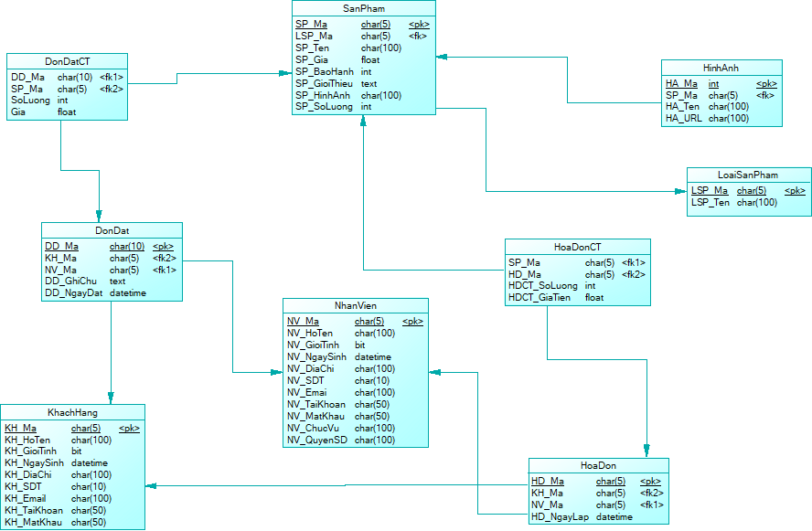

# CamIPStore
> Giới thiệu

Đây là đồ án môn học phát triển ứng dụng web với .NET (TN230)<br>
CamIPStore là một website bán CameraIP
> Thành viên

1. B1809127	Trần Văn Hòa
2. B1809217	Trần Phong Bão
3. B1809231	Đoàn Huỳnh Giao
4. B1809293	Trịnh Thanh Thảo
5. B1809538	Lâm Thị Băng Tuyền
6. B1809310 Võ Hoàng Bảo Trâm
## Qui ước đặt tên branch
1. <b>Khi tạo mới một chức năng</b>: ```features/<ten_chuc_nang>```<br/>
2. <b>Khi cập nhật một chức năng</b>: ```update/<ten_chuc_nang>```<br/>
3. <b>Khi fix bug một chức năng</b>: ```fixbug/<ten_chuc_nang>```<br/>
## Lưu ý
Không sử dụng nhánh master chỉ merge vào develop <br/>
Nhánh sau khi pull request sẽ không sử dụng lại nữa <br/>
## Cơ sở dữ liệu
<br />
## Lệnh để migration cơ sở dữ liệu
```
update-database
```
## Tài liệu tham khảo
- Playlist hướng dẫn ASP.NET Core [Làm dự án với ASP.NET Core 3.1](https://www.youtube.com/playlist?list=PLRhlTlpDUWsyN_FiVQrDWMtHix_E2A_UD).
- Video hướng dẫn sử dụng Git và GitHub [Cách sử dụng Git trong THỰC TẾ | Github](https://youtu.be/O5uT6p6VWjY)
- Tài liệu học EntityFramework Core [Link](https://www.entityframeworktutorial.net/efcore/entity-framework-core.aspx)
## Nhật ký làm việc
<table>
  <tr>
    <th></th>
    <th>Thành viên</th>
    <th>Công việc thực hiện</th>
    <th>Trạng thái</th>
    <th>Thời gian</th>
    <th>Địa điểm</th>
  </tr>
  <tr>
    <td rowspan="5">Buổi 1</td>
    <td>Trần Văn Hòa</td>
    <td>Hướng đẫ sử dụng git <br> Tìm teamplate <br> Tạo dự án ban đầu <br>Mời mọi người vào dự án</td>
    <td align="center">:heavy_check_mark:</td>
    <td rowspan="5" align="center">18:30 - 21:40<br>16/05/2021</td>
    <td rowspan="5">Căn tin TTHL</td>
  </tr>
  <tr>
    <td>Trần Phong Bão</td>
    <td>Ủa m làm cái gì t quên rồi<br>Tham gia vào dự án</td>
    <td align="center">:heavy_check_mark:</td>
  </tr>
  <tr>
    <td>Trịnh Thanh Thảo</td>
    <td>Học sử dụng git<br>Tham gia vào dự án</td>
    <td align="center">:heavy_check_mark:</td>
  </tr>
  <tr>
    <td>Lâm Thị Băng Tuyền</td>
    <td>Học sử dụng git<br>Tìm teamplate<br>Tham gia vào dự án</td>
    <td align="center">:heavy_check_mark:</td>
  </tr>
  <tr>
    <td>Đoàn Huỳnh Giao</td>
    <td>Học sử dụng git<br>Tìm teamplate<br>Tham gia vào dự án</td>
    <td align="center">:heavy_check_mark:</td>
  </tr>
  <tr>
    <td rowspan="6">Buổi 2</td>
    <td>Trần Văn Hòa</td>
    <td>Chuẩn bị layout admin và user</td>
    <td align="center">:date: 19/6/2021</td>
    <td rowspan="6" align="center">19:45 - 20:15<br>18/06/2021</td>
    <td rowspan="6">online</td>
  </tr>
  <tr>
    <td>Trần Phong Bão</td>
    <td></td>
    <td align="center"></td>
  </tr>
  <tr>
    <td>Trịnh Thanh Thảo</td>
    <td>KHÔNG HỌP</td>
    <td align="center"></td>
  </tr>
  <tr>
    <td>Lâm Thị Băng Tuyền</td>
    <td>Migration dữ liệu</td>
    <td align="center">:date: 19/6/2021</td>
  </tr>
  <tr>
    <td>Đoàn Huỳnh Giao</td>
    <td></td>
    <td align="center"></td>
  </tr>
  <tr>
    <td>Võ Hoàng Bảo Trâm</td>
    <td>Mới vô</td>
    <td align="center"></td>
  </tr>
</table>
